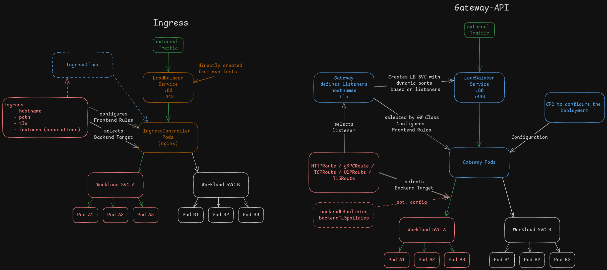

Install k3s without ingress
===

# Installing a simple kubernetes cluster based on k3s
```bash
❯ export INSTALL_K3S_EXEC="\
        --disable=traefik \
        --tls-san=dvoc24.v3nc.org \
        --node-external-ip=213.95.48.135"

❯ curl -sfL https://get.k3s.io | sh -
```

# The kubeconfig to access the cluster is located at
`/etc/rancher/k3s/k3s.yaml`

# Check the cluster access
```bash
❯ kubectl get nodes

NAME     STATUS   ROLES                  AGE   VERSION
dvoc24   Ready    control-plane,master   19h   v1.30.5+k3s1
```

<!-- end_slide -->

Install argocd
===

```bash
❯ kubectl create ns argocd

namespace/argocd created
```

```bash
❯ helm dependency build argocd

Getting updates for unmanaged Helm repositories...
...Successfully got an update from the "https://argoproj.github.io/argo-helm" chart repository
Hang tight while we grab the latest from your chart repositories...
Update Complete. ⎈Happy Helming!⎈
Saving 1 charts
Downloading argo-cd from repo https://argoproj.github.io/argo-helm
Deleting outdated charts
```

```bash
❯ helm template argocd --namespace argocd --include-crds argocd | kubectl apply -n argocd -f -

serviceaccount/argocd-application-controller created
serviceaccount/argocd-applicationset-controller created
serviceaccount/argocd-notifications-controller created
serviceaccount/argocd-repo-server created
serviceaccount/argocd-server created
serviceaccount/argocd-dex-server created
secret/argocd-notifications-secret created
secret/argocd-secret created
configmap/argocd-cm created
configmap/argocd-cmd-params-cm created
configmap/argocd-gpg-keys-cm created
configmap/argocd-notifications-cm created
configmap/argocd-rbac-cm created
configmap/argocd-ssh-known-hosts-cm created
configmap/argocd-tls-certs-cm created
configmap/argocd-redis-health-configmap created
customresourcedefinition.apiextensions.k8s.io/applications.argoproj.io created
customresourcedefinition.apiextensions.k8s.io/applicationsets.argoproj.io created
customresourcedefinition.apiextensions.k8s.io/appprojects.argoproj.io created
clusterrole.rbac.authorization.k8s.io/argocd-application-controller created
clusterrole.rbac.authorization.k8s.io/argocd-notifications-controller created
clusterrole.rbac.authorization.k8s.io/argocd-server created
clusterrolebinding.rbac.authorization.k8s.io/argocd-application-controller created
clusterrolebinding.rbac.authorization.k8s.io/argocd-notifications-controller created
clusterrolebinding.rbac.authorization.k8s.io/argocd-server created
role.rbac.authorization.k8s.io/argocd-application-controller created
role.rbac.authorization.k8s.io/argocd-applicationset-controller created
role.rbac.authorization.k8s.io/argocd-notifications-controller created
role.rbac.authorization.k8s.io/argocd-repo-server created
role.rbac.authorization.k8s.io/argocd-server created
role.rbac.authorization.k8s.io/argocd-dex-server created
rolebinding.rbac.authorization.k8s.io/argocd-application-controller created
rolebinding.rbac.authorization.k8s.io/argocd-applicationset-controller created
rolebinding.rbac.authorization.k8s.io/argocd-notifications-controller created
rolebinding.rbac.authorization.k8s.io/argocd-repo-server created
rolebinding.rbac.authorization.k8s.io/argocd-server created
rolebinding.rbac.authorization.k8s.io/argocd-dex-server created
service/argocd-applicationset-controller created
service/argocd-repo-server created
service/argocd-server created
service/argocd-dex-server created
service/argocd-redis created
deployment.apps/argocd-applicationset-controller created
deployment.apps/argocd-notifications-controller created
deployment.apps/argocd-repo-server created
deployment.apps/argocd-server created
deployment.apps/argocd-dex-server created
deployment.apps/argocd-redis created
statefulset.apps/argocd-application-controller created
serviceaccount/argocd-redis-secret-init created
role.rbac.authorization.k8s.io/argocd-redis-secret-init created
rolebinding.rbac.authorization.k8s.io/argocd-redis-secret-init created
job.batch/argocd-redis-secret-init created
```

<!-- end_slide -->
Access argocd with the created initial admin password and local portforwarding
===

# To access argocd through the browser
```bash
❯ kubectl port-forward svc/argocd-server 8443:443

Forwarding from 127.0.0.1:8443 -> 8080
Forwarding from [::1]:8443 -> 8080
```

```bash
❯ kubectl get secrets argocd-initial-admin-secret -o json | jq '.data.password' -r | base64 -d

<redacted>
```

# With the argocd cli the `--core` flag uses the k8s-api
```bash
❯ argocd app sync argocd --core

TIMESTAMP                  GROUP              KIND                            NAMESPACE
2024-10-04T19:56:16+02:00                     ConfigMap                       argocd
2024-10-04T19:56:16+02:00                     ServiceAccount                  argocd
...
GROUP        KIND         NAMESPACE  NAME           STATUS  HEALTH  HOOK  MESSAGE
argoproj.io  Application  argocd     argocd         Synced                application.ar...
argoproj.io  Application  argocd     ingress-nginx  Synced                application.ar...
```

<!-- end_slide -->
Sync the applications
===
# Cert manager for automatic tls certificate generation from Let's Encrypt.
```bash
❯ argocd app sync cert-manager --core
```

# Install the NGINX Ingress Controller
```bash
❯ argocd app sync ingress-nginx --core
❯ kubectl get svc -n ingress-nginx

NAME                     TYPE          CLUSTER-IP    EXTERNAL-IP    PORT(S)
ingress-nginx-controller LoadBalancer  10.43.187.48  213.95.48.135  80:31742/TCP,443:32358/TCP
```

<!-- pause -->
# Ingress controller implementation for HAProxy LoadBalancer
```bash
❯ argocd app sync ingress-haproxy --core
❯ kubectl get svc -n ingress-haproxy

NAME                               TYPE         CLUSTER-IP    EXTERNAL-IP   PORT(S)
ingress-haproxy-kubernetes-ingress LoadBalancer 10.43.164.147 213.95.48.135 18000:30132/TCP,18443:30199/TCP,18443:30199/UDP,1024:32020/TCP,6060:32409/TCP
```

<!-- end_slide -->
Sync the applications
===
# Contour is an ingress controller for Kubernetes that works by deploying the Envoy proxy
```bash
❯ argocd app sync ingress-contour --core
❯ kubectl get svc -n ingress-contour

NAME                  TYPE         CLUSTER-IP    EXTERNAL-IP   PORT(S)
ingress-contour-envoy LoadBalancer 10.43.245.106 213.95.48.135 28000:32451/TCP,28443:30234/TCP
```

<!-- pause -->
# Traefik Proxy as your Kubernetes Ingress Controller
```bash
❯ argocd app sync ingress-traefik --core
❯ kubectl get svc -n ingress-traefik

NAME             TYPE          CLUSTER-IP     EXTERNAL-IP    PORT(S)
ingress-traefik  LoadBalancer  10.43.221.155  213.95.48.135  38000:30269/TCP,38443:31270/TCP
```


<!-- end_slide -->
Access through ingress
===

# Check Loadbalancer Services
```bash
❯ kubectl get svc -A | grep Loadbalancer

NAME                        TYPE CLUSTER-IP     EXTERNAL-IP    PORT(S)
ing-nginx-controller        LB   10.43.187.48   213.95.48.135  80:31742/TCP,443:32358/TCP
ing-haproxy-haproxy-ingress LB   10.43.168.250  213.95.48.135  18000:30512/TCP,18443:32390/TCP
ing-contour-envoy           LB   10.43.245.106  213.95.48.135  28000:32451/TCP,28443:30234/TCP
ing-traefik                 LB   10.43.221.155  213.95.48.135  38000:30269/TCP,38443:31270/TCP
```

# Check the different values.yaml for each ingress-controller
```
ingress-contour/values.yaml
ingress-haproxy/values.yaml
ingress-nginx/values.yaml
ingress-traefik/values.yaml
```
<!-- end_slide -->

Install pacman
===

```bash
❯ argocd app sync pacman --core
```

# pacman is accessible through contour
```bash
❯ curl http://pacman.dvoc24.v3nc.org:28000
```

<!-- end_slide -->
Install pacman
===

# Check ingress
```bash
❯ kubectl get ingress -A

NAMESPACE   NAME             CLASS    HOSTS                    ADDRESS         PORTS     AGE
argocd      argocd-server    nginx    argocd.dvoc24.v3nc.org   213.95.48.135   80, 443   23h
pacman      pacman-ingress   <none>   pacman.dvoc24.v3nc.org   213.95.48.135   80, 443   23h
```

# Check ingressClasses
```bash
❯ kubectl get ingressclass

NAME              CONTROLLER                                                  PARAMETERS
contour           projectcontour.io/ingress-contour/ingress-contour-contour   <none>
haproxy           haproxy.org/ingress-controller/haproxy                      <none>
ingress-traefik   traefik.io/ingress-controller                               <none>
nginx             k8s.io/ingress-nginx                                        <none>
```

<!-- end_slide -->

Switch from ingress to gateway-api
===

# Compare Ingress with Gateway-API

[excalidraw](https://excalidraw.com/#room=773766818138c18b8058,bGocVBhLblqf9xTp6v1zXQ)
<!-- end_slide -->

Switch from ingress to gateway-api
===

# Install the gateway-api crds
```bash
❯ kubectl apply -f https://github.com/kubernetes-sigs/gateway-api/releases/download/v1.1.0/standard-install.yaml

customresourcedefinition.apiextensions.k8s.io/gatewayclasses.gateway.networking.k8s.io created
customresourcedefinition.apiextensions.k8s.io/gateways.gateway.networking.k8s.io created
customresourcedefinition.apiextensions.k8s.io/grpcroutes.gateway.networking.k8s.io created
customresourcedefinition.apiextensions.k8s.io/httproutes.gateway.networking.k8s.io created
customresourcedefinition.apiextensions.k8s.io/referencegrants.gateway.networking.k8s.io created
```

- GatewayClass    => Implementation to be used with a Gateway
- Gateway         => Creates a LoadBalancer service
- GRPCRoute       => Routing rule for gRPC traffic
- HTTPRoute       => Routing rule for http(s) traffic, terminating tls at the listener
- ReferenceGrant  => Granting the use of resources from different namespaces

<!-- pause -->
# Experimental vs. Standard crd
```bash
❯ kubectl apply -f https://github.com/kubernetes-sigs/gateway-api/releases/download/v1.1.0/experimental-install.yaml

customresourcedefinition.apiextensions.k8s.io/gatewayclasses.gateway.networking.k8s.io configured
customresourcedefinition.apiextensions.k8s.io/gateways.gateway.networking.k8s.io configured
customresourcedefinition.apiextensions.k8s.io/grpcroutes.gateway.networking.k8s.io configured
customresourcedefinition.apiextensions.k8s.io/httproutes.gateway.networking.k8s.io configured
customresourcedefinition.apiextensions.k8s.io/referencegrants.gateway.networking.k8s.io configured

customresourcedefinition.apiextensions.k8s.io/backendlbpolicies.gateway.networking.k8s.io created
customresourcedefinition.apiextensions.k8s.io/backendtlspolicies.gateway.networking.k8s.io created
customresourcedefinition.apiextensions.k8s.io/tcproutes.gateway.networking.k8s.io created
customresourcedefinition.apiextensions.k8s.io/tlsroutes.gateway.networking.k8s.io created
customresourcedefinition.apiextensions.k8s.io/udproutes.gateway.networking.k8s.io created
```

- backendLBpolicies   => Configuraiton for session persistence
- backendTLSpolicies  => Backend TLS configuration (reencrypting the traffic)
- TCPRoute            => Routing rule for TCP traffic
- TLSRoute            => Routing rule for TLS traffic using the SNI header, without decrypting the traffic stream to the backend
- UDPRoute            => Routing rule for UDP traffic
<!-- end_slide -->

Install Envoy Gateway
===

# Change the targetRevision in the argocd/values.yaml
```diff
< targetRevision: ingress
> targetRevision: gateway-envoy
```

# Removing ingress controllers apps and deploy gateway-envoy application
```bash
❯ argocd app sync argocd --core --prune
❯ argocd app sync argocd --core --prune --resource "argoproj.io:Application:gateway-envoy"
```

# Switch to the gateway-haproxy branch
```bash
❯ git checkout gateway-envoy
```
### Pacman is accessible through http and https


# argocd needs a BackendTLSPolicy to allow https backend traffic
```yaml
---
apiVersion: gateway.networking.k8s.io/v1alpha3
kind: BackendTLSPolicy
metadata:
  name: argocd-server
spec:
  targetRefs:
  - group: ''
    kind: Service
    name: argocd-server
  validation:
    caCertificateRefs:
      - group: ''
        kind: ConfigMap
        name: ca
    hostname: argocd.dvoc24.v3nc.org
```
Cert-Manager must enable its gateway-api feature.

<!-- end_slide -->
Install Traefik (v3) with gateway-api. (helm chart >v28.0.0)
===

# Change the targetRevision in the argocd/values.yaml
```diff
< targetRevision: gateway-envoy
> targetRevision: gateway-traefik
```

# Removing envoy and CRDs. Create traefik application
```bash
❯ argocd app sync argocd --core --prune --resource "argoproj.io:Application:gateway-envoy"
❯ argocd app sync argocd --core --prune --resource "argoproj.io:Application:gateway-traefik"
❯ kubectl delete -f https://github.com/kubernetes-sigs/gateway-api/releases/download/v1.1.0/experimental-install.yaml
❯ argocd app sync gateway-traefik --core
```

## Gateway and GatewayClass through helm values
## LoadBalancer SVC is created from helm chart
## No support for BackendTLSPolicy yet (https://github.com/traefik/traefik/pull/11009 merged 3 weeks ago)
<!-- end_slide -->

Install haproxy with gateway-api
===

# Change the targetRevision in the argocd/values.yaml
```diff
< targetRevision: gateway-traefik
> targetRevision: gateway-haproxy
```

# Removing traefik and CRDs. Create haproxy application, haproxy requires an old CRD version.
```bash
❯ argocd app sync argocd --core --prune --resource "argoproj.io:Application:gateway-traefik"
❯ argocd app sync argocd --core --prune --resource "argoproj.io:Application:gateway-haproxy"
❯ kubectl delete -f https://github.com/kubernetes-sigs/gateway-api/releases/download/v1.1.0/experimental-install.yaml
❯ kubectl apply -f https://github.com/kubernetes-sigs/gateway-api/releases/download/v0.5.1/experimental-install.yaml

customresourcedefinition.apiextensions.k8s.io/gatewayclasses.gateway.networking.k8s.io created
customresourcedefinition.apiextensions.k8s.io/gateways.gateway.networking.k8s.io created
customresourcedefinition.apiextensions.k8s.io/httproutes.gateway.networking.k8s.io created
customresourcedefinition.apiextensions.k8s.io/referencegrants.gateway.networking.k8s.io created
customresourcedefinition.apiextensions.k8s.io/referencepolicies.gateway.networking.k8s.io created
customresourcedefinition.apiextensions.k8s.io/tcproutes.gateway.networking.k8s.io created
customresourcedefinition.apiextensions.k8s.io/tlsroutes.gateway.networking.k8s.io created
customresourcedefinition.apiextensions.k8s.io/udproutes.gateway.networking.k8s.io created
namespace/gateway-system created
validatingwebhookconfiguration.admissionregistration.k8s.io/gateway-api-admission created
service/gateway-api-admission-server created
deployment.apps/gateway-api-admission-server created
serviceaccount/gateway-api-admission created
clusterrole.rbac.authorization.k8s.io/gateway-api-admission created
clusterrolebinding.rbac.authorization.k8s.io/gateway-api-admission created
role.rbac.authorization.k8s.io/gateway-api-admission created
rolebinding.rbac.authorization.k8s.io/gateway-api-admission created
job.batch/gateway-api-admission created
job.batch/gateway-api-admission-patch created

❯ argocd app sync gateway-haproxy --core
```

## Old crds are used
## only TCP Route is supported
## LoadBalancer SVC from values

<!-- end_slide -->
Install nginx gateway fabric
===

# Change the targetRevision in the argocd/values.yaml
```diff
< targetRevision: gateway-haproxy
> targetRevision: gateway-nginx
```

# Removing traefik-gateway and CRDs. Create gateway-traefik application, haproxy requires an old CRD version.
```bash
❯ argocd app sync argocd --core --prune --resource "argoproj.io:Application:gateway-haproxy"
❯ kubectl delete -f https://github.com/kubernetes-sigs/gateway-api/releases/download/v0.5.1/experimental-install.yaml
```

# Apply nginx crd distribution
```bash
❯ kubectl kustomize "https://github.com/nginxinc/nginx-gateway-fabric/config/crd/gateway-api/standard?ref=v1.4.0" | kubectl apply -f -

customresourcedefinition.apiextensions.k8s.io/gatewayclasses.gateway.networking.k8s.io created
customresourcedefinition.apiextensions.k8s.io/gateways.gateway.networking.k8s.io created
customresourcedefinition.apiextensions.k8s.io/grpcroutes.gateway.networking.k8s.io created
customresourcedefinition.apiextensions.k8s.io/httproutes.gateway.networking.k8s.io created
customresourcedefinition.apiextensions.k8s.io/referencegrants.gateway.networking.k8s.io created
```

```bash
❯ kubectl kustomize "https://github.com/nginxinc/nginx-gateway-fabric/config/crd/gateway-api/experimental?ref=v1.4.0" | kubectl apply -f -

customresourcedefinition.apiextensions.k8s.io/backendtlspolicies.gateway.networking.k8s.io created
customresourcedefinition.apiextensions.k8s.io/gatewayclasses.gateway.networking.k8s.io configured
customresourcedefinition.apiextensions.k8s.io/gateways.gateway.networking.k8s.io configured
customresourcedefinition.apiextensions.k8s.io/grpcroutes.gateway.networking.k8s.io configured
customresourcedefinition.apiextensions.k8s.io/httproutes.gateway.networking.k8s.io configured
customresourcedefinition.apiextensions.k8s.io/referencegrants.gateway.networking.k8s.io configured
customresourcedefinition.apiextensions.k8s.io/tcproutes.gateway.networking.k8s.io created
customresourcedefinition.apiextensions.k8s.io/tlsroutes.gateway.networking.k8s.io created
customresourcedefinition.apiextensions.k8s.io/udproutes.gateway.networking.k8s.io created
```

<!-- end_slide -->
Install nginx gateway fabric
===

# Sync argocd to deploy gateway-nginx
```bash
❯ argocd app sync argocd --core --prune --resource "argoproj.io:Application:gateway-nginx"
```

## GatewayClass from helm chart
## LoadBalancer SVC from values
## backendTLSpolicies did not work for me (argocd)

<!-- end_slide -->
Conclution
===

<!-- column_layout: [1, 1] -->

<!-- column: 0-->
# ingress
- Each deployment has its own values schema
- Limited features. The Ingress API only supports TLS termination and simple content-based request routing of HTTP traffic.
- Reliance on annotations for extensibility. The annotations approach to extensibility leads to limited portability as every implementation has its own supported extensions that may not translate to any other implementation.
- Implementation specific CRDs to extend features. (e.g. taefik)
- Insufficient permission model. The Ingress API is not well-suited for multi-team clusters with shared load-balancing infrastructure.

## List of implementations
https://kubernetes.io/docs/concepts/services-networking/ingress-controllers/

<!-- column: 1-->
# gateway-api
- Role-oriented - Gateway is composed of API resources which model organizational roles that use and configure Kubernetes service networking.
- Portable - This isn't an improvement but rather something that should stay the same. Just as Ingress is a universal specification with numerous implementations, Gateway API is designed to be a portable specification supported by many implementations.
- Expressive - Gateway API resources support core functionality for things like header-based matching, traffic weighting, and other capabilities that were only possible in Ingress through custom annotations.
- Extensible - Gateway API allows for custom resources to be linked at various layers of the API. This makes granular customization possible at the appropriate places within the API structure.

## List of implementations
https://gateway-api.sigs.k8s.io/implementations/

<!-- reset_layout -->
---
-
Its not perfect
## You have to test each implementation how feature complete it is
## Complex helm values are still a thing (in some cases)
## Only 1/4 of the implementation did work really well

-
No benefits when
## ingress features are enough for you
## your cluster setup is small (not operated by different teams)
